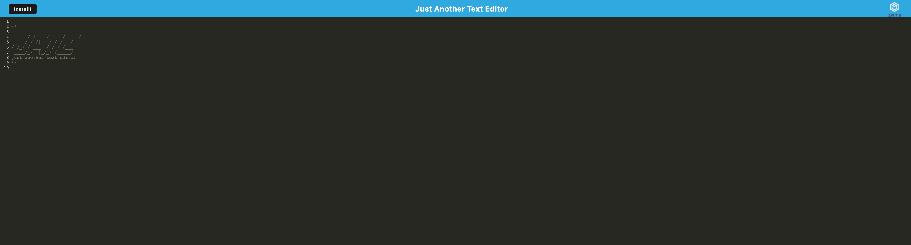

# PWA Text Editor

## Description
the purpose of the PWA Text Editor is to showcase the power of PWA to the user. with this application the user will be able to interact with a text editor known as J.A.T.E (Just another text editor) they would be to write, edit, and delete text that will be save to the users browser in the indexDB. the application has a service worker that will allow the user to continue to use the application regardless of web connection. The user will also be allowed to install the application from the website.

## Usage
When the user opens the webpage they will be able to start utilizing the text editor. whatever the user types will be automatically saved in the indexDB the user will be able to update and delete text at any time. if the users internet connection goes out they will still have access to the webpage due to the service worker if the user wishes to install the the PWA they can click the install button which will prompt them if they wish to continue. if the user clicks install the app will be installed in their computer.

## Demo 
To interact with the website click [here]()
here are some pictures of the website 

## License

MIT License

Copyright (c) 2023 Samuel DeJesus

Permission is hereby granted, free of charge, to any person obtaining a copy of this software and associated documentation files (the "Software"), to deal in the Software without restriction, including without limitation the rights to use, copy, modify, merge, publish, distribute, sublicense, and/or sell copies of the Software, and to permit persons to whom the Software is furnished to do so, subject to the following conditions:

The above copyright notice and this permission notice shall be included in all copies or substantial portions of the Software.

THE SOFTWARE IS PROVIDED "AS IS", WITHOUT WARRANTY OF ANY KIND, EXPRESS OR IMPLIED, INCLUDING BUT NOT LIMITED TO THE WARRANTIES OF MERCHANTABILITY, FITNESS FOR A PARTICULAR PURPOSE AND NONINFRINGEMENT. IN NO EVENT SHALL THE AUTHORS OR COPYRIGHT HOLDERS BE LIABLE FOR ANY CLAIM, DAMAGES OR OTHER LIABILITY, WHETHER IN AN ACTION OF CONTRACT, TORT OR OTHERWISE, ARISING FROM, OUT OF OR IN CONNECTION WITH THE SOFTWARE OR THE USE OR OTHER DEALINGS IN THE SOFTWARE.

